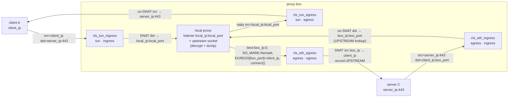
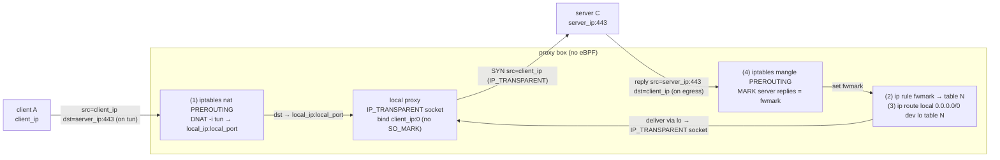
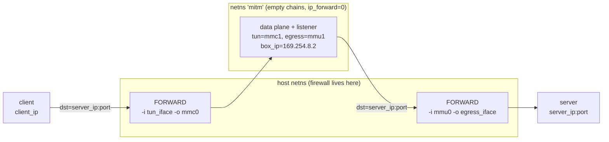

# Data-plane flows

`mymitmproxy` moves packets with one of **three concrete flows**. They fall out of
**two orthogonal choices**:

1. **Data plane** — `data_plane = ebpf | iproute` (config) / `--data-plane` (CLI).
   Default `ebpf`. `ebpf` does the divert + source-IP rewrite in-kernel with
   tc-eBPF; `iproute` does it with visible `iptables` / `ip rule` / `ip route` /
   `sysctl` plumbing and no eBPF.
2. **Attach mode**, *within the eBPF plane only* — `attach_mode = auto | tcx | tc`
   (config) / `--attach-mode` (CLI). Default `auto`. This selects **how** the four
   eBPF classifiers attach to the interfaces; it has no effect when
   `data_plane = iproute`.

So **TCX** and **TC/clsact** are two attach modes of the *same* eBPF data plane —
they run the identical classifiers and the identical source-IP-preservation
mechanism, and differ only in the attach/teardown machinery. **iproute** is a
separate data plane entirely. That gives the three flows this document covers:

| Flow | Selected by |
|------|-------------|
| **eBPF · TCX** | `data_plane=ebpf`, `attach_mode=tcx` (or `auto` on kernel ≥ 6.6) |
| **eBPF · TC (clsact)** | `data_plane=ebpf`, `attach_mode=tc` (or `auto` on kernel < 6.6) |
| **iproute** | `data_plane=iproute` |

`auto` is **not** a fourth flow: it resolves at runtime to TCX or TC (see
[How to select](#how-to-select)). It is what lets one binary work from kernel
**4.15 → 6.6+** unchanged.

## Comparison

| | eBPF · TCX | eBPF · TC (clsact) | iproute |
|---|---|---|---|
| **Data plane / mode** | `ebpf` / `tcx` | `ebpf` / `tc` | `iproute` |
| **Kernel requirement** | ≥ 6.6 (TCX link interface) | 4.x – 6.x (validated on 4.15 & 5.10) | needs `xt_tcpudp` (`NETFILTER_XT_MATCH`) → a full distro kernel |
| **How it intercepts** | 4 tc-eBPF classifiers attached via **TCX links** on `tun_iface` + `egress_iface` | same 4 classifiers attached via a **`clsact` qdisc + classic tc-bpf** (netlink) | `iptables nat PREROUTING` **DNAT** on `tun_iface` → local listener |
| **How src-IP is preserved** | in-kernel SNAT: `cls_eth_egress` rewrites src `box_ip → client_ip`; `EGRESS`/`UPSTREAM` maps drive it; upstream socket carries `SO_MARK=fwmark` to select the flow | *identical to TCX* | `IP_TRANSPARENT` bind to `client_ip:0` (src is the client's directly); `mangle MARK` on replies + `ip rule fwmark→table` + `local` route re-catch the replies |
| **Teardown / fail-open** | RAII: dropping the object releases the links, kernel auto-detaches — even on **SIGKILL**. `tc` is never touched | `Drop` detaches the 4 filters + removes the `clsact` qdisc (`tc qdisc del`). Clean exit/SIGTERM only; **SIGKILL leaves the qdisc** → `--cleanup` | `Drop` reverses the 4 rules + restores sysctls. Clean exit/SIGTERM only; **SIGKILL leaves state** → `--cleanup` |
| **Visibility / stealth** | **config-clean**: nothing in `iptables`/`nft`/`ip rule`/`ip route`; visible only to BPF tooling (`bpftool`, `tc filter show`) | config-clean for netfilter, but adds a **visible `clsact` qdisc + filters** (`tc qdisc/filter show`) | **not stealthy by design**: visible `iptables` (nat + mangle), `ip rule`, `ip route`, and sysctl changes |
| **Sysctls it sets** | route_localnet (loopback `local_addr`) + rp_filter, when `manage_sysctls=true` (default; saved & restored). `=false` → none, fail-fast instead | route_localnet (loopback `local_addr`) + rp_filter, when `manage_sysctls=true` (default; saved & restored). `=false` → none, fail-fast instead | `ip_forward=1`, `rp_filter=0` (all + both ifaces), `route_localnet=1` (both ifaces); each saved & restored |

> **eBPF & sysctls.** By default (`manage_sysctls = true`) the eBPF plane sets the
> two sysctls it needs and restores them on exit: `net.ipv4.conf.<tun_iface>.route_localnet=1`
> (only when `local_addr` is a loopback address — otherwise packets DNAT'd to it are
> martian-dropped) and `net.ipv4.conf.{all,<tun_iface>}.rp_filter=0` (or the client's
> preserved source is reverse-path dropped). Each change is logged at WARN and reverted
> on clean exit / SIGTERM. On **SIGKILL** the restore cannot run, so the changes —
> notably the box-wide `net.ipv4.conf.all.rp_filter=0` — are left in place until reset
> manually (`sysctl -w ...`); the same caveat as the clsact qdisc on the tc path.
> Set `manage_sysctls = false` (or `--manage-sysctls=false`) to
> keep the plane fully config-clean: it then changes nothing and instead **fails fast at
> startup** with the exact `sysctl` commands to run, or you can point `local_addr` at a
> non-loopback IP to avoid `route_localnet` entirely. Unlike the iproute plane, eBPF does
> not touch the egress interface's sysctls (its upstream leg uses the box's real IP).

---

## eBPF data plane (shared by TCX and TC)

Both eBPF attach modes run the **same four classifiers** on the **same two
interfaces**, defined once in `PROGRAMS` (`mymitm/src/bpf.rs`):

| Program | Interface | Direction | Job |
|---------|-----------|-----------|-----|
| `cls_tun_ingress` | `tun_iface` | ingress | DNAT client→server flow to the local listener |
| `cls_tun_egress`  | `tun_iface` | egress  | un-DNAT the listener's replies back to look like the real server |
| `cls_eth_egress`  | `egress_iface` | egress | SNAT the marked upstream flow's source `box_ip → client_ip` |
| `cls_eth_ingress` | `egress_iface` | ingress | un-SNAT the server's replies back to the box |

The rewrite *decisions* live in the host-unit-tested
`mymitm_common::classify_tun` / `classify_eth` (`mymitm-common/src/lib.rs`); the
kernel programs (`mymitm-ebpf/src/main.rs`) are the thin glue that reads the skb,
asks the classifier, and applies the rewrite + checksum fixups. Three maps wire
it together:

- **`CONFIG`** (`Array`, 1 entry) — the NBO config (IPs, ports, `fwmark`),
  populated by userspace at load.
- **`EGRESS`** (`LruHashMap<u16,u32>`, 1024) — `box_ephemeral_port → client_ip`,
  written by userspace **before** `connect()`, read by `cls_eth_egress`.
- **`UPSTREAM`** (`LruHashMap`, 1024) — reverse SNAT mapping recorded by
  `cls_eth_egress`, consumed by `cls_eth_ingress`.

**Source-IP-preservation mechanism, precisely:**

- On `tun_iface`: `cls_tun_ingress` DNATs the client→server flow's *destination*
  to `local_ip:local_port` (source left as `client_ip`, so the accepted socket's
  peer address *is* the client IP — that's how the client is learned per
  connection). `cls_tun_egress` un-DNATs the listener's replies, rewriting their
  *source* back to `server_ip:server_port`.
- On `egress_iface`: `BpfPlane::upstream_socket` binds `box_ip:0` (kernel assigns
  an ephemeral `box_port`), sets `SO_MARK=fwmark`, publishes
  `EGRESS[box_port] = client_ip` **before** `connect()` (so the very first SYN is
  SNAT'd), then connects. `cls_eth_egress` matches the marked flow, looks up
  `EGRESS[box_port]`, records the reverse mapping in `UPSTREAM`, and rewrites the
  *source* `box_ip → client_ip` (the source **port** stays the box's ephemeral
  port — only the IP is preserved). `cls_eth_ingress` matches replies from
  `server_ip:server_port`, looks up `UPSTREAM` keyed on the packet's own
  destination, and un-SNATs the destination back to `box_ip:box_port` **before the
  routing decision**, so the kernel delivers them to our socket instead of
  forwarding them on.

> **Fail-visible, never-wrong-IP.** If `cls_eth_egress` finds **no** `EGRESS`
> entry for the source port, it returns `TC_ACT_OK` and leaves the packet
> **untouched** — the box's own IP is used. A missing mapping degrades to "no
> SNAT" (visible), never to "SNAT to the wrong client".

> **Toggling preservation.** Preservation is on by default. Setting
> `preserve_src_ip = false` (or passing `--preserve-src-ip=false`) makes
> `BpfPlane::upstream_socket` skip publishing `EGRESS[box_port]` altogether, so
> `cls_eth_egress` takes exactly the untouched path above and the flow egresses
> with `box_ip` — the server sees the box, not the client. In the iproute plane
> the same flag skips the `IP_TRANSPARENT` bind and does a plain `connect()`. This
> is standard (non-transparent) proxy behavior and the negative control for
> source-IP preservation. The VM harness exercises it via
> `tests/vm/run.sh … --no-preserve`.

**Packet path (identical for TCX and TC):**



The TCX and TC subsections below differ **only** in how these four programs
attach and detach — the packet path above is unchanged between them.

### Flow 1 — eBPF · TCX

Modern kernels only. Each classifier attaches through the **TCX link** interface:
`attach_with_options(iface, dir, TcAttachOptions::TcxOrder(..))`
(`attach_one`, `mymitm/src/bpf.rs`). TCX requires **kernel ≥ 6.6**.

Teardown is **fail-open by RAII**: the TCX links are owned by the process's file
descriptors. When `BpfPlane` drops — normal exit, SIGTERM, or even **SIGKILL** —
the kernel releases the links and auto-detaches the programs, and traffic reverts
to normal forwarding. `Drop` needs no explicit teardown and **never touches
`tc`**. Nothing is left behind, so `--cleanup` has nothing to do for a
TCX-attached run.

```mermaid
sequenceDiagram
  participant P as mymitm (userspace)
  participant K as kernel (TCX)
  P->>K: attach_with_options(iface, dir, TcxOrder) — ×4 hooks
  Note over P,K: TCX link fds owned by the process
  P-->>K: exit / SIGTERM / SIGKILL
  K-->>K: fds closed → links released → programs auto-detach
  Note over K: traffic reverts to normal forwarding (fail-open); tc untouched
```

### Flow 2 — eBPF · TC (clsact)

The legacy path for kernels **< 6.6** (e.g. 4.15, 5.10). `attach_tc`
(`mymitm/src/bpf.rs`) first ensures a `clsact` qdisc exists on the iface
(`tc::qdisc_add_clsact`, `EEXIST` ignored), then attaches the classifier via
netlink (`TcAttachOptions::Netlink`). Packet path is exactly the eBPF diagram
above.

Teardown is **not** automatic: netlink/tc filters do **not** detach when the
process dies, and the `clsact` qdisc stays behind. So when this path was used
(`used_tc`), `Drop` explicitly (a) detaches the four filters by name via
`tc::qdisc_detach_program`, then (b) removes the `clsact` qdisc entirely. aya 0.13
exposes no clsact-*removal* helper, so the qdisc deletion shells out to
`tc qdisc del dev <iface> clsact`. This runs on clean exit / SIGTERM / panic
unwind; on **SIGKILL** `Drop` never runs and the `clsact` qdisc is left behind —
recover with `--cleanup` (which calls `cleanup_tc`).

```mermaid
sequenceDiagram
  participant P as mymitm (userspace)
  participant K as kernel (clsact + tc-bpf)
  P->>K: tc::qdisc_add_clsact(iface) — EEXIST ignored
  P->>K: attach_with_options(iface, dir, Netlink) — ×4 hooks
  Note over P,K: filters + clsact qdisc persist independently of the process
  P->>K: Drop → qdisc_detach_program ×4, then tc qdisc del dev iface clsact
  Note over K: clean exit/SIGTERM → Drop runs; SIGKILL leaves the qdisc → --cleanup
```

Attachment is verified per path: TCX via `SchedClassifier::query_tcx(iface, dir)`;
legacy tc via `tc filter show` / presence of the `clsact` qdisc.

---

## Flow 3 — iproute

No eBPF at all. `IpRoutePlane::setup` (`mymitm/src/iproute.rs`) installs visible
netfilter / policy-routing state. The rule id is derived from the mark:
`table = 100 + (fwmark & 0xff)`, and the `ip rule` gets a pinned priority
`30000 + table` so teardown deletes exactly our rule.

`build_ruleset` installs, **in order**:

1. **`iptables -t nat -A PREROUTING`** — DNAT the client→server flow arriving on
   `tun_iface` to `local_ip:local_port` (the local listener). (`-m tcp` is loaded
   explicitly so `--dport` is accepted on the nft backend.)
2. **`ip rule add priority <prio> fwmark <mark> lookup <table>`** — marked packets
   consult the custom routing table.
3. **`ip route add local 0.0.0.0/0 dev lo table <table>`** — so marked replies
   addressed to (spoofed) client IPs are delivered locally instead of dropped.
4. **`iptables -t mangle -A PREROUTING`** — MARK the *server's reply* packets
   (arriving on `egress_iface` from `server_ip:server_port`) with `fwmark`, so
   rule (2) routes them to the local table (3). Without this the reply
   (`dst = client_ip`) has no mark and the kernel drops it — `client_ip` is not a
   local address in the main table.

Sysctls set (each saved and restored): `net.ipv4.ip_forward=1`,
`net.ipv4.conf.all.rp_filter=0` + per-iface `rp_filter=0` on both ifaces (Linux
uses the MAX of `all` and per-iface, so both are needed), and
`net.ipv4.conf.<iface>.route_localnet=1` on both ifaces.

`IpRoutePlane::upstream_socket` opens the upstream TCP connection with
`set_ip_transparent_v4(true)` + `set_reuse_address(true)` and binds
`client_ip:0`, so packets egress with the client's source address **directly** —
no rewrite needed. `SO_MARK` is **deliberately NOT set** on this socket: the
upstream SYN must follow the main routing table to reach the server; only the
*replies* are marked, by rule (4).

Everything is reversed in `Drop` (rules in reverse apply order, then sysctls) and
by the standalone `cleanup` used by `--cleanup`. Setup is atomic: on any failure
mid-apply it rolls back what it already applied before returning `Err`.



The **client-facing** return path (listener reply → client) is handled by
standard netfilter **conntrack**, which auto-reverses the rule (1) DNAT
(`src local_ip:local_port → server_ip:server_port`); the iproute plane installs no
explicit un-DNAT rule for it — this is the netfilter-stateful counterpart of the
eBPF plane's explicit `cls_tun_egress`.

Because rule (1) uses a `-p tcp --dport` match, the iproute plane needs
`xt_tcpudp` (`NETFILTER_XT_MATCH`), which a full distro kernel ships. The lean
Cilium-lvh 5.10 *test* kernel is built without it, so the VM harness **skips**
iproute there (a limitation of that test kernel, not the proxy — a real distro
5.10 kernel runs it fine). See `tests/vm/README.md`.

---

## Namespace mode (`netns`, default true) — orthogonal to the data plane

`netns` is a **third, independent** knob: it applies to *both* data planes and
changes **where** the plane runs, not what it does.

### The problem it solves

Interception turns **one FORWARDed flow into two locally-terminated ones**:

| | Without the proxy | With the proxy (either plane) |
|---|---|---|
| client → server | routing: *not local* → **FORWARD** | dst rewritten to `local_addr:local_port` → routing: *local* → **INPUT** |
| box → server | — | new socket, locally generated → **OUTPUT** |
| replies | FORWARD | INPUT/OUTPUT as `ESTABLISHED` |

So on a box whose firewall permits only `FORWARD -d <server> --dport <port>`,
**FORWARD is never traversed for the intercepted port** and both legs are dropped
by the INPUT/OUTPUT policies. This is chain traversal, not anything
plane-specific — which is why it breaks `ebpf` and `iproute` identically.

### The mechanism

Both legs become *forwarded* traffic again from the host's point of view:



The destination is **still the real server** for the whole time the packet is in
the host's stack — the rewrite to `local_addr:local_port` happens *inside* the
namespace, where the chains are empty. So the box's existing forward permission
matches **both** legs and **no firewall rule has to change**. Measured on kernel
4.15: the `FORWARD -d <server> --dport 443 -j ACCEPT` counter shows exactly **two
accepted SYNs per session**, one per leg.

Because `net.ipv4.conf.*` is namespaced, the `route_localnet` / `rp_filter`
changes from `manage_sysctls` land **inside** the namespace and never touch the
box — which also retires the box-wide `conf.all.rp_filter=0` caveat noted above.

### What mymitm does

The parent process plumbs the host side, then re-execs itself
(`ip netns exec <ns> <self> … --netns=false --tun mmc1 --egress mmu1 --box-ip …`)
and supervises that child. The parent deliberately **stays in the host
namespace**: only a process still there can delete the veths, policy rules and
routing tables at teardown, and `setns` moves a single *thread*, which is not
safe underneath a multi-threaded tokio runtime. The child therefore runs the
exact same code path as `netns = false` — only the interface names differ.

| | Value |
|---|---|
| Namespace | `mitm` |
| Client leg (→ child's `tun_iface`) | `mmc0` (host, 169.254.7.1/30) ↔ `mmc1` (ns, 169.254.7.2/30) |
| Upstream leg (→ child's `egress_iface`, `box_ip`) | `mmu0` (host, 169.254.8.1/30) ↔ `mmu1` (ns, **169.254.8.2**) |
| Steer in | `ip rule prio 31000+mask iif <tun_iface> to <server> ipproto tcp dport <port> lookup 300+mask` |
| Steer back | `ip rule prio 32000+mask iif <egress_iface> from <server> ipproto tcp sport <port> lookup 400+mask` |
| Host sysctls | `conf.{mmc0,mmu0}.rp_filter=2` — our own veths only |

Two details worth knowing:

- **Why two veth pairs, not one.** With a single pair (`tun_iface ==
  egress_iface`) all four classifiers share two hooks, and tc runs them in `pref`
  order under `direct-action`, where the **first program to return `TC_ACT_OK`
  ends the chain**. On ingress `cls_eth_ingress` takes the lower pref, accepts
  every client packet (it only matches replies *from* the server), and
  `cls_tun_ingress` never runs — nothing is rewritten. Measured on 4.15: the flow
  was routed straight through the namespace to the server **un-intercepted**,
  while the client still saw a healthy HTTP 200. Two pairs give each hook exactly
  one program — the arrangement the product already validates on real interfaces.
- **`ip_forward=0` inside the namespace.** If interception ever misses, the packet
  is **dropped** rather than quietly forwarded to the server in the clear. Fail
  closed, not fail open. (The `iproute` plane sets `ip_forward=1` itself during
  setup and restores it on exit, so it does not get this guarantee; it does not
  need forwarding here either.)
- `rp_filter=2` (loose), not `0`: the kernel takes `MAX(conf.all, conf.<iface>)`,
  so **2 loosens even when a hardened box has `conf.all.rp_filter=1`** — no
  box-wide change required.
- **The steer is scoped to TCP `<server_port>`**, which the `ip_forward=0` above
  makes mandatory rather than tidy: anything steered in that the classifiers do
  not rewrite is dropped. An RD Gateway is the motivating case — it serves the
  tunnel on TCP 443 *and* an optional UDP transport on 3391, and an unscoped
  `to <server>` steer would pull the UDP into the namespace and blackhole it.
  With the selectors, UDP 3391 (and ICMP) stay on the main table and are
  forwarded normally, un-intercepted. FIB-rule L4 selectors need **kernel ≥ 4.17**
  and an iproute2 that speaks the syntax. There is **no probe** for that:
  `build_plumbing` emits the scoped rule with the unscoped one as its fallback
  (`Step::alt`), and if `ip rule add` rejects the selectors the fallback is used
  and a WARN names the consequence. Attempting the real rule is the point —
  mymitm must not add and delete a throwaway rule on the host just to interrogate
  the kernel, and the failure that matters is the failure of the rule we actually
  want, not of a stand-in. Each spelling carries its own inverse, because
  `ip rule del` matches exactly. Not steering the server's ICMP costs nothing: the
  classifiers only rewrite TCP, so ICMP steered in was dropped anyway.

### Requirements, and the preflight

Namespace mode needs, all of which a forwarding box already has:

- `net.ipv4.ip_forward=1` on the host;
- the forward path accepting NEW to `<server>:<port>` **without** an `-i`/`-o` match;
- if that accept is scoped to a **source subnet**, `preserve_src_ip` left on;
- the forward path accepting `ESTABLISHED,RELATED` (both return paths).

Two traps, and the startup **preflight** (`netns::diagnose`) **fails fast** on
each with the offending rule and its remedies rather than starting into a silent
blackhole:

- **Interface pinning.** `-A FORWARD -i tun0 -o eth0 -d <server> -j ACCEPT`
  permits the flow **today** but cannot match once the legs become `-o mmc0` /
  `-i mmu0`. Under ufw that is the difference between `ufw route allow to
  <server> port 443 proto tcp` (fine) and `ufw route allow in on tun0 out on eth0
  …` (fatal). The pin can also be **inherited from the path**: if the only way
  into the chain holding the permission is `-A FORWARD -i tun0 -o eth0 -j <chain>`,
  then the accept inside it is equally unusable even though its own text carries no
  interface match. Zone-based frontends (firewalld, shorewall) are built exactly
  that way, so reachability is computed as "which chains can a packet on *our*
  veths get to", not "which chains are jumped to at all" — otherwise the accept
  reads as destination-only and gets confirmed, and the box blackholes with the
  preflight having said it was fine.
- **Source scoping without preservation.** `ufw route allow from <vpn_subnet> to
  <server> …` renders `-s <vpn_subnet> …`, which the client leg matches either
  way — but the upstream leg only carries a source in that subnet while
  `preserve_src_ip` is on. With it off the upstream leg dials from `169.254.8.2`
  and is dropped, so the proxy accepts the connection and then hangs. This is why
  `--preserve-src-ip=false` is not a safe debugging control on such a box.

The preflight reads the **whole filter table** (`iptables -S`) and follows
`-j`/`-g` jumps out of `FORWARD` transitively, because on any box with a firewall
frontend the permission is not in `FORWARD` at all: ufw leaves that chain holding
only jumps and keeps the real rules in **`ufw-user-forward`**. It also matches the
rule's protocol and port, so a permission for a *different* service on the same
address (again: UDP 3391 next to TCP 443) is not miscredited. When it identifies
the rule both legs will match it logs it; when it finds nothing and the forward
path looks restrictive it warns. Check yours with `iptables -S`, not
`iptables -S FORWARD`.

With `netns = false` you run directly on `tun_iface`/`egress_iface` as before,
and must permit the two locally-terminated legs yourself:

```bash
# client leg (both planes)
iptables -I INPUT  -i $TUN -p tcp -m tcp -d $LOCAL_ADDR --dport $LOCAL_PORT -j ACCEPT
# upstream leg — eBPF carries SO_MARK=fwmark; iproute does NOT, and its source is
# the SPOOFED client IP, so do not match on -s <box_ip> there.
iptables -I OUTPUT -o $EGRESS -p tcp -m tcp -m mark --mark $FWMARK -d $SERVER --dport $PORT -j ACCEPT  # ebpf
iptables -I OUTPUT -o $EGRESS -p tcp -m tcp -d $SERVER --dport $PORT -j ACCEPT                          # iproute
```

Validated end to end by `tests/vm/validate-netns.sh` on kernel 4.15, both planes:
a default-DROP firewall (forward → server only, ssh/openvpn in, ntp/logs out)
**blocks** the proxy on the host legs, and with `netns = true` traffic flows again
with the ruleset **byte-for-byte unchanged**, the client's source IP still
preserved, decrypted bytes still dumped, and every trace of the plumbing removed
on exit.

`FW_PROFILE=ufw` expresses the same box through **real, enabled ufw** instead of a
hand-written ruleset — validated on **Debian 11 (kernel 5.10)**, both planes,
with the five commands a reporting box actually runs (`allow in on <mgmt> …
port 22/1194`, `deny from <vpn_subnet>`, `route allow from <vpn_subnet> to
<server> port 443 proto tcp` and `… port 3391 proto udp`, default deny). It adds
three checks the hand-written profile cannot make, each covering something that
was previously assumed rather than observed:

- the permission really is **two jumps below `FORWARD`**
  (`FORWARD → ufw-before-forward → ufw-user-forward`), and the preflight's own log
  line names that chain — so the jump-following is verified against a live table,
  not a fixture;
- `ufw deny from <vpn_subnet>` really is an explicit **`DROP` in
  `ufw-user-input`**, which is what breaks `netns = false` on such a box (not a
  missing allow);
- **UDP 3391 still reaches the server** with `netns = true`, i.e. the L4-scoped
  steer took only TCP `<server_port>`. On a pre-4.17 kernel the steer is unscoped
  and that UDP is *expected* to be blackholed, so the harness probes what the
  product will do and reports the fallback instead of asserting a bug. A control
  run — firewall up, nothing else in play — confirms the datagram forwards plainly
  first, so a later failure cannot be misread as the steer when it is the profile
  or the probe.

Two things that check is only meaningful **because** they are asserted alongside
it, both of which it silently depended on before:

- **the namespace's `ip_forward`.** With forwarding *on* inside the namespace, an
  unscoped steer would pull UDP 3391 in and forward it out to the server anyway —
  so the datagram would arrive and the check would pass while claiming the steer
  was scoped. The validator asserts `0` on the eBPF plane (fail closed) and `1` on
  the iproute plane, which sets it for itself; on that plane it says outright that
  the UDP result is not decisive about scoping.
- **`rp_filter`.** The validator sets `conf.all.rp_filter=1` before any proxy runs.
  mymitm only ever writes `0` there, and Debian's default is already `0`, so on the
  exact target this was built for the "host sysctls untouched" assertion could not
  have failed whatever the product did. With `all=1` it has teeth, and it
  simultaneously exercises the design claim that a per-veth `2` loosens without any
  box-wide change (the kernel takes `MAX(conf.all, conf.<iface>)`).

The `UFW` fixture in `netns.rs`'s tests is this run's verbatim `iptables -S`
output, so the unit tests and the live box parse the same bytes.

## How to select

Both knobs are settable via the TOML config, a CLI flag, or an environment
variable. CLI overrides config.

| Choice | Config key | CLI flag | Env var | Values | Default |
|--------|-----------|----------|---------|--------|---------|
| Data plane | `data_plane` | `--data-plane` | `MYMITM_DATA_PLANE` | `ebpf`, `iproute` | `ebpf` |
| Attach mode (eBPF only) | `attach_mode` | `--attach-mode` | `MYMITM_ATTACH_MODE` | `auto`, `tcx`, `tc` | `auto` |
| Manage sysctls (eBPF only) | `manage_sysctls` | `--manage-sysctls` | `MYMITM_MANAGE_SYSCTLS` | `true`, `false` | `true` |
| Namespace mode | `netns` | `--netns` | `MYMITM_NETNS` | `true`, `false` | `true` |

```toml
# mymitm.toml
data_plane  = "ebpf"   # or "iproute"
attach_mode = "auto"   # "tcx" | "tc"  (ignored when data_plane = "iproute")
```

```bash
# eBPF, auto-detect attach (the shipping default)
sudo ./mymitm --config mymitm.toml

# force the legacy clsact+tc attach (e.g. to test the old-kernel path on a new kernel)
sudo ./mymitm --config mymitm.toml --data-plane ebpf --attach-mode tc

# iproute plane (attach-mode is irrelevant here)
sudo ./mymitm --config mymitm.toml --data-plane iproute
```

**`auto`** (default) tries **TCX first**; on *any* error it falls back to
`clsact+tc`, logging the fallback at **DEBUG** per hook
(`TCX attach unavailable …; using clsact+tc …`) plus **one INFO** summary line of
the path actually used (`… attached via TCX` or `… attached via clsact+tc
(legacy tc path; TCX needs kernel >= 6.6)`). The four DEBUG lines on a < 6.6
kernel are expected, not a fault. `used_tc` is set if *any* hook took the tc path,
and it is what drives the tc teardown in `Drop`.

`--cleanup` reverses leftover state (a stale `clsact` qdisc from the tc path, the
iproute rules, the namespace and its plumbing) from a previous unclean exit,
reports what it removed, and **exits** — it starts no proxy. It runs all three
subsystems' cleanups regardless of the configured `data_plane`, since the process
that left the leftovers may not have run with today's flags. It refuses outright
when the namespace still has processes in it: that is a live instance, and
reversing its plumbing would blackhole it without stopping it. A normal run
self-heals on its own (`NetnsGuard::setup` clears leftovers before plumbing), so
the flag exists only to make a box clean.

## Source

| File | Role |
|------|------|
| `mymitm/src/dataplane.rs` | `DataPlane` trait (`upstream_socket`) + `DirectPlane` (test/debug, no preservation) |
| `mymitm/src/bpf.rs` | eBPF userspace side: `load_and_attach`, `attach_one` (Tcx/Tc/Auto), `attach_tc`, `teardown_tc`, `Drop`, `upstream_socket`, `raise_memlock_rlimit` |
| `mymitm-ebpf/src/main.rs` | kernel classifiers `cls_tun_*` / `cls_eth_*` and the `EGRESS`/`UPSTREAM` map logic |
| `mymitm-common/src/lib.rs` | `classify_tun` / `classify_eth`, `Config`, `Rewrite`, map key/value types & capacities |
| `mymitm/src/iproute.rs` | iproute plane: `build_ruleset` (the 4 rules), `setup`, sysctls, `upstream_socket`, `Drop`, `cleanup` |
| `mymitm/src/netns.rs` | namespace mode: `build_plumbing` (pure spec), `NetnsGuard` (RAII), `diagnose`/`preflight`, `child_argv`, `cleanup` |
| `tests/vm/validate-netns.sh` | default-DROP-firewall validation: reproduces the block, then proves the recipe and `--netns=true` both fix it without touching the firewall |
| `tests/vm/netns/netns-recipe.sh` | the same plumbing as a standalone operator recipe (what `netns.rs` automates) |
| `mymitm/src/config.rs` | `DataPlaneKind` / `AttachMode` enums, defaults, config + CLI wiring |
| `tests/vm/README.md` | 3-VM kernel-4.15 / 5.10 validation matrix (why iproute is skipped on the lvh 5.10 test kernel) |
| `examples/mymitm.toml` | annotated sample config |
